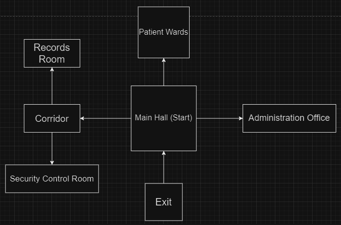

# OutFast - Horror Adventure Game

## Overview
OutFast is a text-based horror adventure game inspired by Outlast 1. Players navigate through Mount Dark Asylum, making crucial decisions that determine their survival and uncover the facility's dark history through interactive cutscenes.

## Game Description
In OutFast, players regain consciousness inside Mount Dark Asylum and must escape by locating the security room to unlock the main exit gate. While exploring, players encounter various cutscenes that reveal the asylum's disturbing past. These narrative elements are optional, allowing players to choose their path through the facility. Each decision can lead to different outcomes, including successful progression, game over scenarios, or alternative endings.

## Level Layout

## Gameplay Mechanics

### Win/Loss Conditions
The primary objective is reaching and successfully navigating the Security Room sequence. Upon entering, players face a series of critical decisions. While fatal choices result in game over, the game features a quick retry mechanism for the final decision to maintain gameplay flow.

#### Winning Path Sequence:
1. Initial Decision
2. Camera System Disable
3. Action Selection
4. Locker Concealment
5. Escape Attempt
6. Path Exploration
7. Hidden Exit Discovery (Victory Condition)

## Technical Implementation

### Core Classes

#### DecisionTree
- Manages the game's choice-based system
- Loads decision structures from external files
- Utilizes HashMap for efficient node access
- Supports modular content expansion
- Implements room-specific decision trees

#### DecisionNode
- Represents individual decision points
- Contains unique identifiers, descriptions, and branching options
- Follows the format: `ROOM;&DECISION_ID;&DESCRIPTION;&OPTIONS`
- Integrates with the existing room system

#### Typewriter
- Implements text animation effects
- Supports multiple text styles (normal, italic, bold)
- Enhances narrative immersion through timed character display